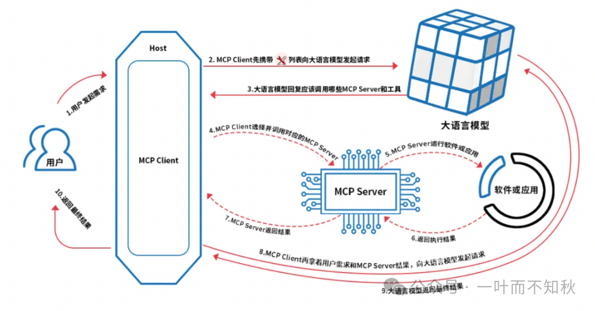
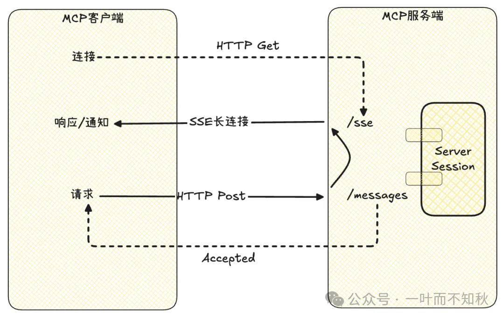

先看这个图，这个描述的很形象！

MCP 是 2024 年底由 Anthropic 提出来的一个通信协议，目的是让大语言模型（LLM）能更顺畅地跟外部数据和工具对接，让AI应用有了链接万物的能力。
简单来说，MCP就像一个“万能插座”，
让各种功能都能通过标准化的接口和大模型对接，实现“即插即用”。

**工作过程：**

MCP Server，负责处理来自MCP Client的请求，并调用各种资源，返回相应的结果或数据。MCP Client，是大模型与MCP Server之间的桥梁；Host，内置了MCP Client的应用程序，可以是APP、Agent、Web应用、桌面应用等形态；

**传输方式**
MCP 采用  JSON-RPC 2.0 协议 来传输数据，并且支持两种传输模式：

基于 stdio 的进程间通信传输，以独立的进程运行在 AI 应用本地，适用于比较轻量级的工具。基于 SSE（Server-Sent Events） 进行远程服务访问，需要将服务单独部署，客户端通过服务端的 URL 进行远程访问，适用于比较重量级的工具。

在新版本中，MCP引入了新的Streamable HTTP远程传输机制来代替之前的HTTP+SSE的远程传输模式（stdio的本地模式不变）。
可参考：[https://mp.weixin.qq.com/s/ip2d62wFzQj51uaRORvflw](https://mp.weixin.qq.com/s?__biz=Mzk1NzQ1ODk5NQ==&mid=2247523548&idx=1&sn=a17699edb459d7be84df03c8271f3e16&scene=21#wechat_redirect)

**SSE传输模式**

客户端首先发送HTTP Get请求到服务端/sse端点  服务端进行响应，建立SSE长连接，并返回后续请求的URI（默认/messages）  客户端使用此URI与服务端交互，发送请求  服务端则通过SSE连接发送响应消息或通知信息给客户端。

**核心概念**
工具 (Tools): 由 MCP 服务器暴露的可执行功能，AI 客户端可以请求使用。资源 (Resources): 由 MCP 服务器暴露的数据和内容，可以作为 AI 的上下文信息使用。  

提示词 (Prompts): 由服务器定义的可重用提示模板，客户端可以使用。

Resources + Tools + Prompts = 完全体：Resources 提供数据原料，Tools 提供动手能力，Prompts 提供套路，三者一结合，LLM 就能从一个只会聊天的基础对话模型变成能干活的超级助手。

